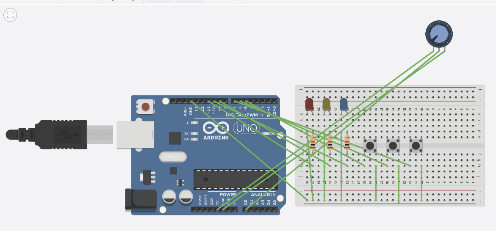
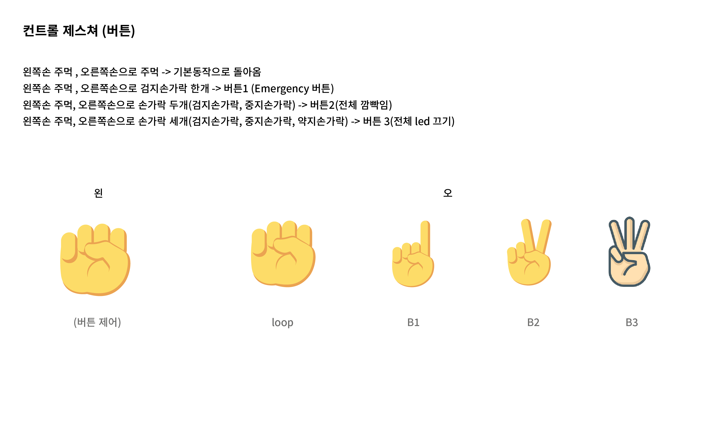
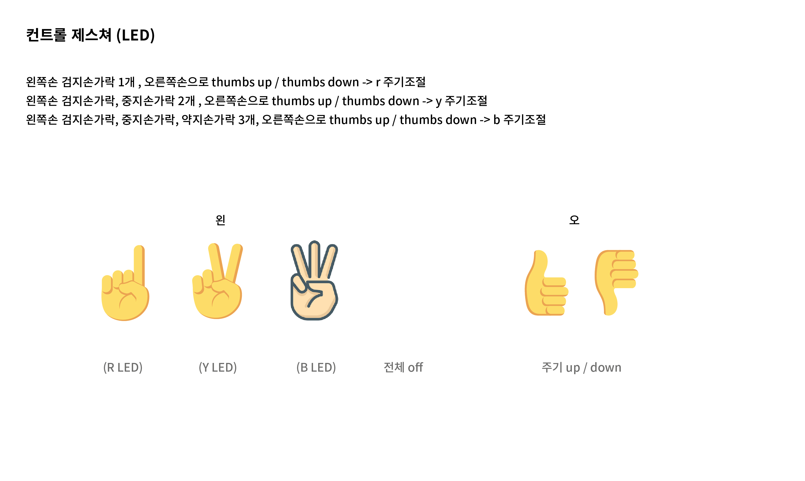

유튜브: https://youtu.be/YRiMoINWs1I
(신호등 비전 컨트롤 설명 영상)
(read me -> 제스처 기반 제어 기능 및 코드 흐름 설명 섹션부터 업데이트 완료)

# 🔆 Arduino + p5.js 기반 인터랙티브 LED 제어 및 시각화 시스템

이 프로젝트는 **Arduino Uno 보드**와 **웹 기반 p5.js 인터페이스**를 연동하여,  
LED 조명 시스템의 상태를 **실시간 시각화**하고, **사용자 제어 기반으로 다양한 모드 동작을 구현**하는 종합 프로젝트입니다.

---

## 📌 프로젝트 개요

본 시스템은 **TaskScheduler를 이용한 LED 제어 알고리즘**,  
**가변저항 기반 밝기 조절**, **3가지 특수 모드(비상/전체 깜빡임/시스템 OFF)**,  
그리고 **p5.js 기반 시리얼 통신 UI**를 결합한 **하드웨어-소프트웨어 통합형 IoT 프로젝트**입니다.

학습 목적, 졸업 프로젝트, 메이커 활동, 교보재로도 적극 활용 가능한 고급 예제입니다.

---

## 🔧 시스템 구성 요소 및 특징

### ✅ 하드웨어 구성 (Arduino Uno 기반)
- **3색 LED (Red, Yellow, Blue)** → Task 기반 순차 점등/깜빡임 제어
- **가변저항 (Potentiometer)** → LED 밝기 실시간 조절
- **3개의 버튼 스위치**
  - Emergency Mode 토글
  - All Blink Mode 토글
  - System ON/OFF 제어

### ✅ 소프트웨어 구성
- **Arduino 코드 (C++)**
  - TaskScheduler로 각 LED 동작을 독립 Task로 관리
  - 버튼 인터럽트를 통한 상태 전환 구현
  - 시리얼 통신 기반 외부 명령 수신 처리
- **p5.js (JavaScript + Web UI)**
  - 시리얼 포트 연결 및 통신
  - 슬라이더 UI로 LED 주기 설정
  - 시각적인 신호등 및 밝기 게이지 표현
  - 시스템 상태 인디케이터 (LOOP/B1/B2/B3)

---

## 🖥 회로 구성도

아래 이미지는 전체 하드웨어 배선 구성을 시각화한 회로도입니다.

### 🪛 핀 연결 요약

| 구성 요소 | 연결 핀 |
|-----------|----------|
| RED LED   | D11 (PWM) |
| YELLOW LED| D9 (PWM) |
| BLUE LED  | D10 (PWM) |
| 가변저항(POT) | A0 (Analog 입력) |
| Emergency 버튼 | D5 (Interrupt 핀) |
| All Blink 버튼 | D6 (Interrupt 핀) |
| System ON/OFF 버튼 | D7 (Interrupt 핀) |

> 모든 버튼은 **INPUT_PULLUP 모드**로 동작하며, LED에는 **220Ω~330Ω 저항**이 연결되어 전류를 제한합니다.
> 버튼의 기본 상태는 HIGH, 눌리면 LOW

---

## 🔄 시스템 동작 흐름

### 기본 루프 모드
1. **RED → YELLOW → BLUE → BLUE BLINK(3회) → YELLOW → RED ... 반복**
2. 각 단계는 `TaskScheduler`로 관리되어 비동기적이고 독립적으로 작동

### 특수 모드
| 모드 | 설명 |
|------|------|
| Emergency Mode (B1) | RED LED가 깜빡이며 시스템 Task 중단 |
| All Blink Mode (B2) | 모든 LED가 동기화된 주기로 깜빡임 |
| System OFF Mode (B3) | 모든 Task 종료 및 LED OFF 상태 유지 |

---

## 📡 시리얼 통신 명령 포맷

### ✅ p5.js → Arduino 명령어

| 명령어 예시 | 기능 설명 |
|-------------|-----------|
| `RED_TIME:1000` | RED Task 주기를 1000ms로 설정 |
| `YELLOW_TIME:700` | YELLOW Task 주기를 700ms로 설정 |
| `BLUE_TIME:1500` | BLUE Task 주기를 1500ms로 설정 |

### ✅ Arduino → p5.js 상태 전송

| 메시지 | 의미 |
|--------|------|
| `B:128` | 현재 밝기값 (0~255) |
| `LED:RED`, `LED:BLUE_BLINK`, ... | 현재 LED 상태 |
| `LED_STATE:ON` or `OFF` | 깜빡임 상태 (ON: 점등 중) |
| `B1`, `B2`, `B3` | 시스템 상태 표시

---

## 🌈 p5.js 인터페이스 기능 설명

### 🎚 슬라이더 UI
- `Red Period` : RED Task 주기 조절
- `Yellow Period` : YELLOW Task 주기 조절
- `Blue Period` : 고정값, 비활성화됨

### 🖥 시각화 요소
- **LED 신호등** : 현재 상태에 따라 색상 점등
- **밝기 게이지 바** : 가변저항 상태 반영
- **System State 인디케이터** : LOOP, B1, B2, B3 상태 원형 표시
- **Connect 버튼** : 시리얼 포트 연결/해제

---

## 🧩 사용 부품 목록

- Arduino Uno R3 보드
- 브레드보드
- LED (RED, YELLOW, BLUE)
- 저항 (220Ω~330Ω) × 3
- 가변저항(Potentiometer) × 1
- 푸시 버튼 스위치 × 3
- 점퍼 와이어 세트

---

## 💡 활용 아이디어

- **교육용 실습 (물리+코딩 통합 수업)**
- **졸업 프로젝트/캡스톤 디자인**
- **스마트 조명 시스템의 기초 구성 실습**
- **웹-하드웨어 연동 기술 습득**

---

---

---

## 🖐️ 제스처 기반 제어 기능 및 코드 흐름 설명

본 시스템은 **웹캠 영상 기반의 손 제스처 인식 (ml5.js HandPose)** 기술을 활용하여,  
물리 버튼 없이도 **시스템 모드 전환 및 LED 주기 조절을 비접촉 방식으로 제어**할 수 있도록 설계되었습니다.

### ✋ 제어 기능 개요

- **왼손 주먹 + 오른손 손가락 개수** → 시스템 모드 전환 (LOOP / B1 / B2 / B3)
- **왼손 손가락 개수 + 오른손 Thumbs Up/Down** → LED 주기 조절 (RED / YELLOW / BLUE)

### 🔄 제어 흐름 설명

#### 1. 손 인식 및 분류
- 웹캠에서 양손이 인식되면, 손목 좌표를 기준으로 **왼손과 오른손을 구분**합니다.
  (화면 기준 오른쪽 → 왼손, 왼쪽 → 오른손)

#### 2. 왼손 주먹 상태 감지 → 시스템 모드 제어
- 왼손 손가락이 모두 접혀 주먹 상태일 경우, 시스템은 **오른손의 손가락 개수에 따라 모드 전환**을 수행합니다.
  - 0개 → 기본 루프 모드(LOOP)
  - 1개 → 비상 모드(B1)
  - 2개 → 전체 깜빡임 모드(B2)
  - 3개 → 시스템 OFF 모드(B3)

#### 3. 왼손 손가락 수 + 오른손 엄지 제스처 → LED 주기 조절
- 왼손이 주먹이 아닐 경우, **왼손의 손가락 개수로 대상 LED(R/Y/B)**를 지정합니다.
- 오른손 엄지손가락이 위로 향하면 해당 LED 주기를 증가시키고(Thumbs Up), 아래로 향하면 감소시킵니다(Thumbs Down).
  - 1개 → RED LED 조절
  - 2개 → YELLOW LED 조절
  - 3개 → BLUE LED 조절

#### 4. 중복 동작 방지
- 사용자의 제스처가 반복적으로 빠르게 입력되는 것을 방지하기 위해,  
  **0.5초 간격의 쿨다운 타이머**가 적용되어 있습니다.

#### 5. 시리얼 명령 전송
- 제스처로 결정된 명령은 p5.js가 시리얼 통신을 통해 Arduino로 전송합니다.
  - 예: `B2`, `RED_TIME:1300`, `YELLOW_TIME:800` 등

---

## ⚙️ 아두이노 시리얼 명령 처리 함수 설명 (`processSerialCommands()`)

Arduino 측에서는 p5.js로부터 전달된 명령어를 **`processSerialCommands()` 함수**에서 해석하고 처리합니다.

### 🔸 동작 방식 요약

1. 시리얼 포트로 전달된 명령을 한 줄 단위로 읽습니다.
2. 명령어가 단일 문자열(예: `B1`, `LOOP`)이면 **시스템 모드 전환**으로 처리됩니다.
3. 명령어에 `:` 구분자가 포함되어 있다면, **LED 주기 설정 명령어**로 인식하고  
   각 TaskScheduler의 주기 설정 함수를 통해 해당 LED Task의 주기를 변경합니다.
4. 모든 상태 변경 후, Arduino는 현재 상태를 p5.js로 다시 전송하여 UI와 상태를 동기화합니다.

### 🔸 처리 예시

- `B1` → Emergency 모드 진입, RED 깜빡임, 모든 Task 종료
- `B2` → All Blink 모드, 모든 LED 동시 깜빡임 Task 실행
- `RED_TIME:1200` → RED LED Task의 주기를 1200ms로 재설정

이 방식은 **모드 제어와 주기 제어를 명확하게 분리**하면서도,  
하나의 통합 함수(`processSerialCommands()`) 내에서 효율적으로 처리할 수 있도록 설계되어 있습니다.

---

### ✅ 시스템 구성 흐름 요약

1. 사용자가 손 제스처 입력
2. p5.js가 손 상태 해석 → 명령어 생성
3. 시리얼 통신으로 Arduino에 전송
4. `processSerialCommands()` 함수가 명령어 분석 및 시스템 반영
5. 결과 상태 다시 p5.js로 전송 → UI 갱신

---

### ✅ 특징 정리
- **비접촉 방식의 직관적인 제어 시스템**
- **웹 UI + 제스처 + 하드웨어 연동의 통합 시스템 구조**
- **실시간 LED 동작 시각화 및 사용자 피드백 제공**

